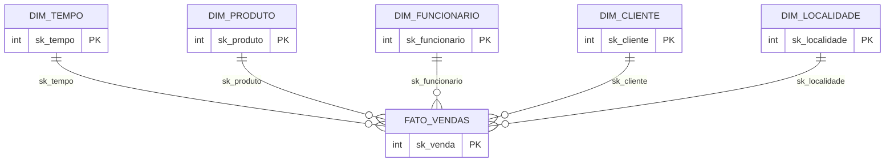
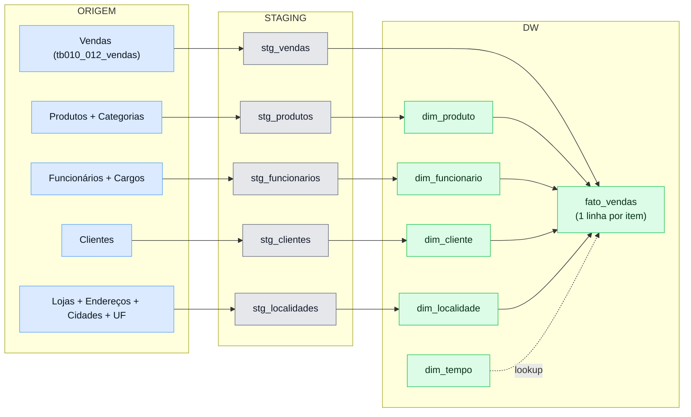

# DW_Varejo — Cardinalidades, Chaves (NK/SK), SCD Tipo 2 e Staging

Este documento explica, de forma detalhada e didática, as cardinalidades do modelo dimensional do DW_Varejo, o papel das chaves naturais (NK) e substitutas (SK), como o SCD Tipo 2 se aplica ao projeto, e por que a camada de Staging é necessária. O conteúdo reflete o DW implementado via scripts SQL neste repositório, com observações e recomendações práticas.

---

## 1) Visão Geral do Modelo Dimensional (Star Schema)

No DW_Varejo, utilizamos um esquema em estrela com uma tabela fato principal e cinco dimensões:

- Fato: `fato_vendas` (granularidade: 1 linha por item vendido)
- Dimensões: `dim_tempo`, `dim_produto`, `dim_funcionario`, `dim_cliente`, `dim_localidade`

Visual (ERD simplificado):



Interpretação rápida:

- Cada linha da `fato_vendas` referencia exatamente 1 membro de cada dimensão (tempo, produto, funcionário, cliente e localidade).
- Cada membro de uma dimensão pode estar associado a muitas linhas da `fato_vendas`.

---

## 2) Cardinalidades e o “por quê” (explicação educativa)

Resumo correto para este DW:

- Dimensão → Fato: 1 para N (participação opcional do lado da dimensão: 0..N)
- Fato → Dimensão: por linha da fato, é 1 para 1; no conjunto, é N para 1

Por que é 1:N da dimensão para a fato?

- Um membro dimensional (ex.: um produto específico) pode aparecer em inúmeras vendas ao longo do tempo — logo, 1 produto → N linhas de fato.
- Isso vale para todas as dimensões: 1 cliente pode fazer N compras; 1 funcionário pode realizar N atendimentos; 1 data pode ter N vendas; 1 localidade pode abrigar N vendas.

Por que é 1:1 da fato para a dimensão (por linha)?

- Cada linha de fato representa um evento atômico: “um item vendido” em um momento no tempo, para um cliente, de um produto, por um funcionário, em uma localidade. Não existe ambiguidade: para aquela linha, há exatamente um valor em cada dimensão (1:1 naquela linha).
- Ao olhar várias linhas de fato, veremos muitas apontando para o mesmo membro dimensional; por isso dizemos que, no agregado, é N:1 da fato para a dimensão.

Por que não seria “0..N” do lado da fato em relação à dimensão?

- Do ponto de vista da integridade referencial, a chave estrangeira mora na tabela fato. Para uma linha de fato existir, ela deve referenciar um registro dimensional válido. Quando a origem não informa (valor ausente), adotamos o membro “Desconhecido” (SK = -1). Assim, cada linha de fato sempre aponta para exatamente 1 membro dimensional (não 0).
- Já a dimensão pode existir sem nenhuma linha de fato (produto recém-cadastrado sem vendas). Por isso, matematicamente, a cardinalidade da dimensão para a fato admite 0..N; porém, em modelagem dimensional, costuma-se simplificar como 1:N.

Visual educativo das duas perspectivas (compatível com Mermaid no GitHub):

```mermaid
flowchart LR
  subgraph PERS_LINHA [Perspectiva da Linha de Fato]
    F[Fato (uma linha)] -->|exatamente 1| DT[(Dim Tempo)]
    F -->|exatamente 1| DP[(Dim Produto)]
    F -->|exatamente 1| DF[(Dim Funcionario)]
    F -->|exatamente 1| DC[(Dim Cliente)]
    F -->|exatamente 1| DL[(Dim Localidade)]
  end

  subgraph PERS_DIM [Perspectiva da Dimensao]
    PROD[(Um Produto)] -->|muitas linhas| FV1[Fato]
    PROD -->|muitas linhas| FV2[Fato]
    PROD -->|muitas linhas| FV3[Fato]
  end
```

---

## 3) NK (Natural Key) e SK (Surrogate Key)

Definições simples:

- NK (chave natural): identificador “natural” do negócio oriundo da fonte transacional. Exemplos: CPF do cliente, matrícula do funcionário, código do produto, código da loja.
- SK (chave substituta): identificador sintético (inteiro sequencial) criado no DW para representar univocamente um membro da dimensão.

Como isso aparece no DW_Varejo:

- `dim_produto`: `nk_produto` (código na origem) e `sk_produto` (PK no DW)
- `dim_funcionario`: `nk_matricula` e `sk_funcionario`
- `dim_cliente`: `nk_cpf` e `sk_cliente`
- `dim_localidade`: `nk_loja` e `sk_localidade`
- `dim_tempo`: não tem NK de negócio; o próprio calendário é gerado, e a SK (`sk_tempo`) identifica a data.

Por que não usar só NK?

- Estabilidade: chaves naturais podem mudar (ex.: troca de sistema legando novos códigos), podem não ser únicas entre sistemas ou vir como compostas (piorando desempenho e manutenção).
- Integração: diferentes fontes podem usar códigos distintos para o “mesmo” conceito. A SK padroniza a identidade dentro do DW.
- SCD Tipo 2: se um atributo de dimensão muda (ex.: cargo do funcionário), a NK permanece, mas criamos uma nova versão (novo SK). Sem SK, controlar versões fica muito mais difícil.
- Performance: joins com inteiros simples (SK) são mais eficientes que chaves compostas/strings longas (NK).

E por que manter a NK mesmo tendo SK?

- Auditoria e rastreabilidade ao dado de origem.
- Deduplicação e conformidade: a NK continua sendo o “mesmo membro de negócio” ao longo do tempo (entre versões SCD2), viabilizando agrupamentos por “quem é” e não apenas por “quem estava”.
- Estratégia de lookup no ETL: da staging, procuramos nas dimensões por NK (e, se houver SCD2, também pela vigência temporal) para obter a SK correta a ser gravada na fato.

Boas práticas relacionadas:

- Em dimensões sem SCD2, a NK deve ser única (constraint UNIQUE) para evitar duplicatas.
- Em dimensões com SCD2, a NK repete entre versões; neste caso, a unicidade é por NK + intervalo de vigência (ou um indicador `is_current = true`).

---

## 4) SCD Tipo 2 — O que é e como se aplica aqui

SCD (Slowly Changing Dimension) Tipo 2 preserva o histórico de mudanças dos atributos de uma dimensão criando uma nova linha para cada alteração relevante, com um novo `sk_*`. Assim, a fato registra “qual era” a versão vigente no momento do evento.

Aplicação no DW_Varejo (recomendado onde fizer sentido de negócio):

- Candidatos fortes a SCD2: `dim_funcionario` (promoções, mudanças de cargo), `dim_produto` (mudança de categoria/tipo, eventual mudança de descrição), possivelmente `dim_cliente` (mudança de nome). `dim_localidade` tende a ser mais estável; `dim_tempo` não é SCD.

Como modelar SCD2 (campos típicos):

- `vigente_inicio` (DATE/TIMESTAMP), `vigente_fim` (DATE/TIMESTAMP ou `NULL`), `is_current` (BOOLEAN), opcionalmente um `hash_atributos` para detecção de mudanças.
- PK continua sendo a SK (`sk_*`), a NK identifica o “mesmo membro de negócio” entre versões.

Como a fato “pega” a versão certa?

- No ETL da fato, ao fazer o lookup, usamos a NK + a data do evento para achar a versão cujo intervalo de vigência contenha essa data. Ex.:

```sql
-- Exemplo conceitual de lookup SCD2 (PostgreSQL)
SELECT d.sk_funcionario
FROM dim_funcionario d
WHERE d.nk_matricula = :matricula
  AND :data_evento >= d.vigente_inicio
  AND (:data_evento < d.vigente_fim OR d.vigente_fim IS NULL)
LIMIT 1;
```

Por que isso é bom?

- Análises históricas corretas: o relatório de “vendas por cargo” no ano passado deve refletir o cargo que o funcionário tinha naquele período, não o cargo atual.
- Auditoria e reprodutibilidade: refazer um relatório antigo deve dar o mesmo resultado.

Observação sobre o estado atual do repositório:

- Os scripts fornecidos criam dimensões simples (sem colunas de vigência) e não implementam SCD2. O conteúdo acima descreve como aplicar SCD2 caso seja uma necessidade do negócio — o que é comum em `dim_funcionario` e, às vezes, em `dim_produto` e `dim_cliente`.

Visual SCD2 (exemplo em `dim_funcionario`, usando flowchart para ampla compatibilidade):

```mermaid
flowchart LR
  classDef ver fill:#eef,stroke:#99f,stroke-width:1px
  A[2022-01\nSK=10\ncargo=Vendedor Jr\n(vigente_inicio=2022-01-01)] --> B[2023-07\nSK=27\ncargo=Vendedor Pl]
  B --> C[2024-10\nSK=41\ncargo=Supervisor]
  class A,B,C ver
```

---

## 5) Staging — Por que existe e como funciona

A camada de Staging (`staging_varejo`) é um “estacionamento” temporário dos dados extraídos do OLTP, antes de entrarem no DW. Objetivos:

- Desacoplar a extração da transformação/carga (tornar o ETL reprocessável e auditável).
- Padronizar tipos, nomes, domínios e normalizar/denormalizar quando necessário.
- Enriquecer/derivar atributos (ex.: `tipo_produto` a partir da descrição de categoria; `regiao` a partir de UF).
- Filtrar, deduplicar e tratar valores ausentes.

Staging no DW_Varejo (tabelas criadas nos scripts):

- `stg_produtos(cod_produto, descricao_produto, cod_categoria, descricao_categoria, tipo_produto)`
- `stg_funcionarios(matricula, nome_funcionario, nome_cargo)`
- `stg_clientes(cpf, nome_cliente)`
- `stg_localidades(cod_loja, estado, tipo_loja, regiao)`
- `stg_vendas(cod_venda, cpf_cliente, cod_produto, matricula_funcionario, data_venda, quantidade, valor_unitario, valor_total, numero_atendimento)`

Fluxo visual (origem → staging → DW):



Observações importantes do ETL atual:

- `valor_total` é pré-calculado em `stg_vendas` (quantidade × valor_unitario) e carregado na fato.
- Lookups nas dimensões usam NK para obter a SK a ser gravada na fato. Quando não houver correspondência, usa-se o registro “Desconhecido” (SK = -1) para manter a integridade e permitir análises.
- Localidade: como a origem de vendas não carrega a loja explicitamente, o ETL seleciona uma localidade padrão já cadastrada (primeiro registro positivo). É um fallback; se a informação de loja passar a existir, recomenda-se substituir pela loja correta. Alternativamente, usar sempre SK = -1 (“Localidade Desconhecida”) quando não houver dado confiável.

---

## 6) As escolhas são boas? Trade-offs e recomendações

Escolhas acertadas no modelo atual:

- Esquema em estrela simples e direto (fato de vendas + dimensões conformadas).
- Uso de SK nas dimensões e FK na fato: melhora a performance e prepara o terreno para SCD2.
- NK preservada para rastreabilidade e lookups do ETL.
- Registro “Desconhecido” (-1) em cada dimensão: mantém integridade e evita perda de fatos.
- Camada de Staging explícita: limpa, deriva e estabiliza os dados antes do DW.

O que pode ser evoluído:

- Implementar SCD2 nos atributos que mudam com o tempo (especialmente `dim_funcionario`). Isso corrige relatórios históricos quando há mudança de cargo/descrição.
- Definir `UNIQUE` para NK nas dimensões sem SCD2; ao habilitar SCD2, ajustar a regra para NK + vigência.
- Considerar `dimensão degenerada` para `numero_atendimento` (se houver análise textual/categórica do número em si); no momento ele está como métrica/atributo da fato, o que é aceitável.
- Ajustar a regra de localidade (se possível) para não usar padrão que possa “diluir” análises regionais; preferir SK=-1 quando não houver dado de loja.

---

## 7) Resumo executivo

- Cardinalidades: Dimensão→Fato = 1:N (com participação opcional 0..N); Fato→Dimensão (por linha) = 1:1; no conjunto, N:1.
- NK (da origem) + SK (do DW) trabalham juntas: NK para rastrear o “quem é” de negócio; SK para estabilidade, performance e SCD2.
- SCD2 cria novas versões de membros quando atributos mudam; a fato aponta para a versão vigente no momento do evento.
- Staging dá qualidade, auditabilidade e previsibilidade ao ETL, evitando carregar “sujeira” diretamente no DW.

---

### Apêndice — Exemplos práticos de lookup

Lookup simples (sem SCD2):

```sql
-- Buscar SK de produto pela NK
SELECT sk_produto
FROM dim_produto
WHERE nk_produto = :cod_produto;
```

Lookup SCD2 (com vigência temporal):

```sql
-- Buscar SK do funcionário vigente na data do evento
SELECT sk_funcionario
FROM dim_funcionario
WHERE nk_matricula = :matricula
  AND :data_evento >= vigente_inicio
  AND (vigente_fim IS NULL OR :data_evento < vigente_fim)
ORDER BY vigente_inicio DESC
LIMIT 1;
```
