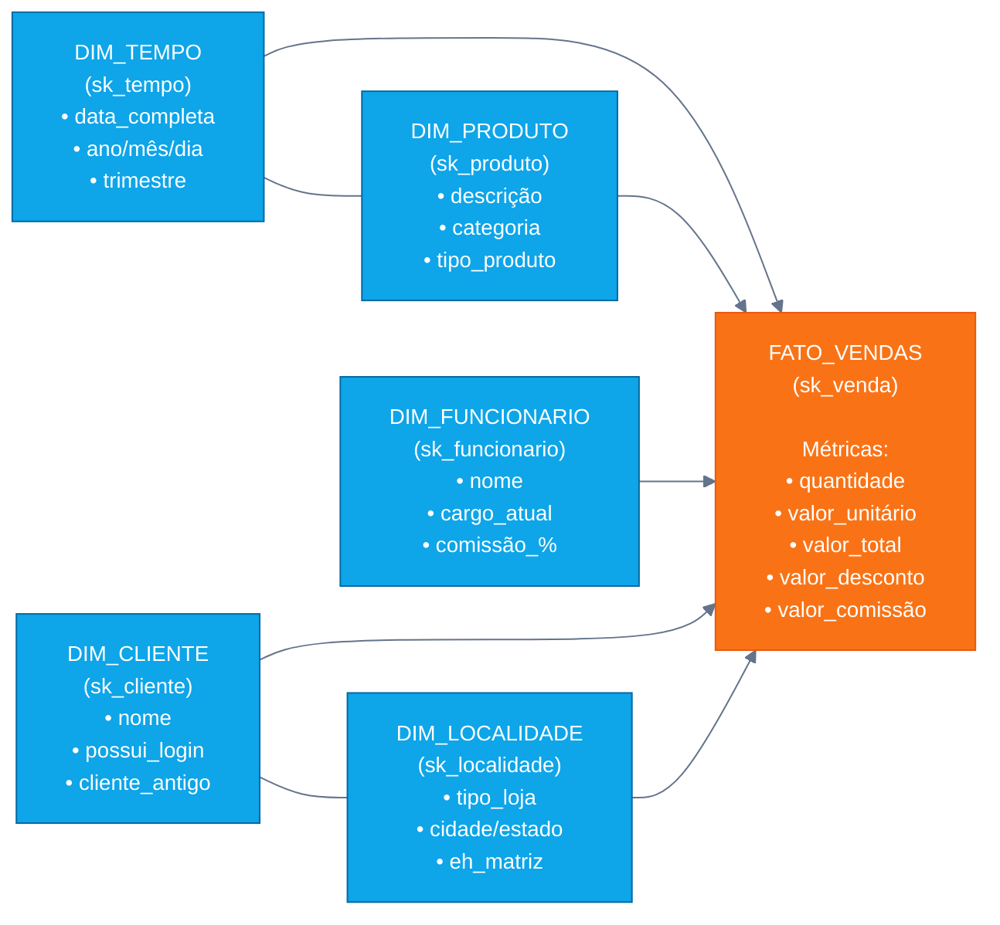
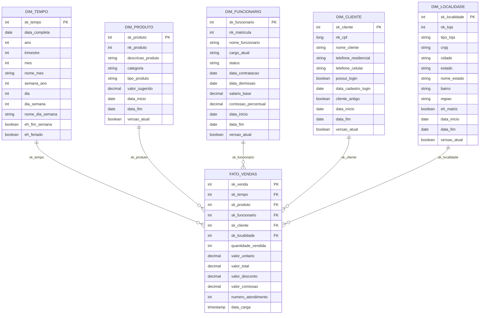
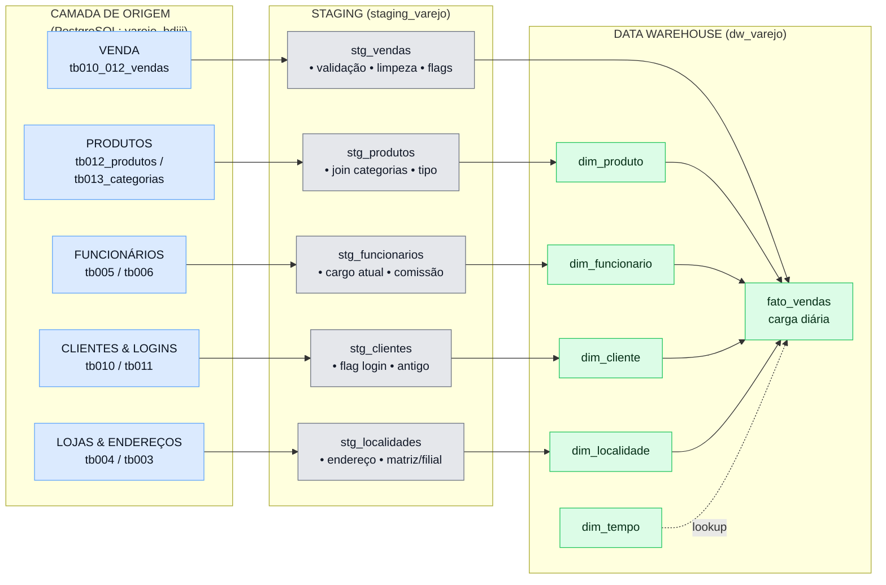

# Data Warehouse - DW_Varejo
## Estrutura Completa do DW 
---

## 📊 Modelo Dimensional — Star Schema

---

## 🧩 ERD com cardinalidades e atributos

---

## 🔄 Fluxo ETL (origem → staging → DW)

---

## 📚 Estrutura das tabelas

<b>DIM_TEMPO</b>

| Campo | Tipo | Observação |
|---|---|---|
| sk_tempo | INTEGER | PK (surrogate) |
| data_completa | DATE | not null |
| ano, trimestre, mes, semana_ano, dia, dia_semana | INTEGER | hierarquia de tempo |
| nome_mes, nome_dia_semana | VARCHAR(20) | textos |
| eh_fim_semana, eh_feriado | BOOLEAN | flags |

<b>DIM_PRODUTO</b>

| Campo | Tipo | Observação |
|---|---|---|
| sk_produto | INTEGER | PK |
| nk_produto | INTEGER | NK |
| descricao_produto, categoria, tipo_produto | VARCHAR | not null |
| valor_sugerido | NUMERIC(10,2) |  |
| data_inicio, data_fim | DATE | SCD2 |
| versao_atual | BOOLEAN | default true |

<b>DIM_FUNCIONARIO</b>

| Campo | Tipo | Observação |
|---|---|---|
| sk_funcionario | INTEGER | PK |
| nk_matricula | INTEGER | NK |
| nome_funcionario, cargo_atual | VARCHAR |  |
| status | VARCHAR(20) | Ativo/Inativo |
| data_contratacao, data_demissao | DATE |  |
| salario_base, comissao_percentual | NUMERIC |  |
| data_inicio, data_fim, versao_atual | DATE/BOOLEAN | SCD2 |

<b>DIM_CLIENTE</b>

| Campo | Tipo | Observação |
|---|---|---|
| sk_cliente | INTEGER | PK |
| nk_cpf | BIGINT | NK |
| nome + telefones | VARCHAR |  |
| possui_login, cliente_antigo | BOOLEAN |  |
| data_cadastro_login | DATE | se houver login |
| data_inicio, data_fim, versao_atual | DATE/BOOLEAN | SCD2 |

<b>DIM_LOCALIDADE</b>

| Campo | Tipo | Observação |
|---|---|---|
| sk_localidade | INTEGER | PK |
| nk_loja | INTEGER | NK |
| tipo_loja, cnpj, cidade, estado, nome_estado, bairro, regiao | VARCHAR |  |
| eh_matriz | BOOLEAN |  |
| data_inicio, data_fim, versao_atual | DATE/BOOLEAN | SCD2 |

<b>FATO_VENDAS</b>

| Campo | Tipo | Observação |
|---|---|---|
| sk_venda | SERIAL | PK |
| sk_tempo / sk_produto / sk_funcionario / sk_cliente / sk_localidade | INTEGER | FKs |
| quantidade_vendida, valor_unitario, valor_total, valor_desconto, valor_comissao | NUMERIC | métricas |
| numero_atendimento | INTEGER |  |
| data_carga | TIMESTAMP | default now() |

---
