# Data Warehouse - DW_Varejo
## Estrutura Completa do DW 
---

## 📊 Modelo Dimensional — Star Schema

```mermaid
%%{init: {'theme':'neutral','themeVariables':{
  'primaryColor':'#e2e8f0','lineColor':'#64748b','fontSize':'14px'
}, 'flowchart':{'curve':'basis','padding':16}}}%%
flowchart LR
  classDef fact fill:#f97316,stroke:#ea580c,color:#fff,stroke-width:1px;
  classDef dim  fill:#0ea5e9,stroke:#0369a1,color:#fff,stroke-width:1px;

  DT["DIM_TEMPO\n(sk_tempo)\n• data_completa\n• ano/mês/trimestre\n• dia_semana"]:::dim
  DP["DIM_PRODUTO\n(sk_produto)\n• descrição\n• categoria\n• tipo_produto"]:::dim
  DFN["DIM_FUNCIONARIO\n(sk_funcionario)\n• nome\n• cargo_atual"]:::dim
  DC["DIM_CLIENTE\n(sk_cliente)\n• nome\n• cpf"]:::dim
  DL["DIM_LOCALIDADE\n(sk_localidade)\n• tipo_loja\n• regiao"]:::dim

  FV["FATO_VENDAS\n(sk_venda)\n\nMétricas:\n• quantidade_vendida\n• valor_total\n• numero_atendimento"]:::fact

  DT --> FV
  DP --> FV
  DFN --> FV
  DC --> FV
  DL --> FV

  %% layout helpers
  DT ---| | DP
  DC ---| | DL
```

---

## 🧩 ERD com cardinalidades e atributos

---

## 🔄 Fluxo ETL (origem → staging → DW)

---

## 📚 Estrutura das tabelas

<b>DIM_TEMPO</b>

| Campo | Tipo | Observação |
|---|---|---|
| sk_tempo | SERIAL | PK (surrogate) |
| data_completa | DATE | not null, unique |
| ano | INTEGER | not null |
| trimestre | INTEGER | not null (1-4) |
| mes | INTEGER | not null (1-12) |
| nome_mes | VARCHAR(20) | not null |
| dia_semana | INTEGER | not null (0-6, 0=Domingo) |
| nome_dia_semana | VARCHAR(20) | not null |

<b>DIM_PRODUTO</b>

| Campo | Tipo | Observação |
|---|---|---|
| sk_produto | SERIAL | PK |
| nk_produto | INTEGER | NK - código original |
| descricao_produto | VARCHAR(255) | not null |
| categoria | VARCHAR(255) | not null |
| tipo_produto | VARCHAR(100) | not null - derivado da categoria |

<b>DIM_FUNCIONARIO</b>

| Campo | Tipo | Observação |
|---|---|---|
| sk_funcionario | SERIAL | PK |
| nk_matricula | INTEGER | NK - matrícula |
| nome_funcionario | VARCHAR(255) | not null |
| cargo_atual | VARCHAR(255) | not null |

<b>DIM_CLIENTE</b>

| Campo | Tipo | Observação |
|---|---|---|
| sk_cliente | SERIAL | PK |
| nk_cpf | BIGINT | NK - CPF |
| nome_cliente | VARCHAR(255) | not null |

<b>DIM_LOCALIDADE</b>

| Campo | Tipo | Observação |
|---|---|---|
| sk_localidade | SERIAL | PK |
| nk_loja | INTEGER | NK - código da loja |
| tipo_loja | VARCHAR(50) | not null - Matriz/Filial |
| regiao | VARCHAR(50) | not null - Norte/Sul/Sudeste/etc |

<b>FATO_VENDAS</b>

| Campo | Tipo | Observação |
|---|---|---|
| sk_venda | SERIAL | PK |
| sk_tempo | INTEGER | FK para dim_tempo |
| sk_produto | INTEGER | FK para dim_produto |
| sk_funcionario | INTEGER | FK para dim_funcionario |
| sk_cliente | INTEGER | FK para dim_cliente |
| sk_localidade | INTEGER | FK para dim_localidade |
| quantidade_vendida | INTEGER | not null |
| valor_total | NUMERIC(10,2) | not null - calculado |
| numero_atendimento | INTEGER | not null |

---
